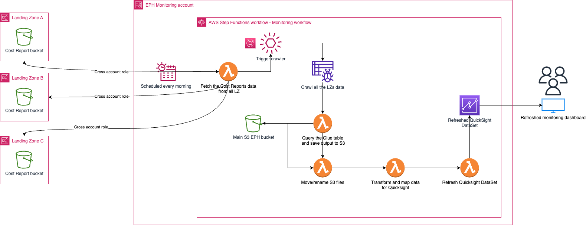
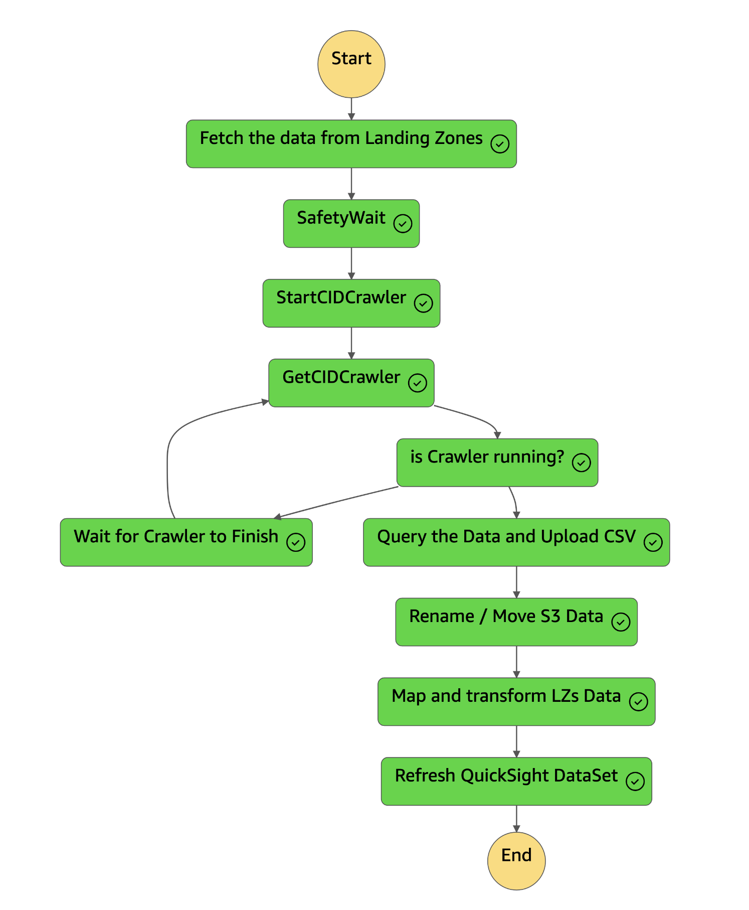

# Quicksight Monitoring Solution for Multiple Landing Zones

This repository contains the AWS SAM templates and documentation for the **Multi Landing Zones Monitoring Automation** solution.

## Overview

The **Multi Landing Zones Monitoring Automation** solution simplifies and streamlines the monitoring of data from multiple Landing Zones. By leveraging **AWS Step Functions**, **AWS Lambdas**, and **AWS EventBridge**, this solution automates the entire monitoring workflow, from data retrieval to data visualization in Quicksight.

## Solution Design

The solution is built and deployed using the **AWS SAM framework**, which enables easy management and deployment of serverless applications. Here's an overview of the solution's design:

1. **Trigger:** The workflow is triggered via **EventBridge Cron**, which schedules the execution of the monitoring process at a specified time (e.g., 2 AM UTC).

2. **Step Functions Workflow:** The EventBridge triggers a **Step Functions** workflow that coordinates the execution of various resources and functions. The workflow ensures the seamless flow of data through each step of the monitoring process.

   

## State Machine Overview

The core of the solution is the **Step Functions state machine**, which consists of several states and transitions that automate the monitoring process. Each state represents a specific task or action to be performed. The overall flow of the state machine is as follows:

0. **Triggering the State Machine:** The state machine is triggered via **EventBridge cron** at a specified time.

### Explanation of the State Machine

1. **Fetch Data from Landing Zones (Lambda):** This state triggers a Lambda function (`S3ReplicationLambda`) to fetch data from all Cost Reports in the Landing Zones. The Lambda function retries the execution in case of specific errors, ensuring data retrieval.

2. **Safety Wait:** This state introduces a brief pause of 5 seconds before proceeding to the next state. It allows time for the crawler to start properly.

3. **Start CID Crawler (Glue):** In this state, the state machine triggers the `CidCrawler` Glue crawler using the `startCrawler` AWS SDK action. The crawler is responsible for extracting metadata and schema information from the data.

4. **Get CID Crawler (Glue):** This state retrieves the status of the `CidCrawler` Glue crawler using the `getCrawler` AWS SDK action. It checks the state and last crawl status of the crawler to determine the next step.

5. **Athena Proceed:** This state represents a decision point where the state machine checks if the `CidCrawler` is in the "READY" state and if the last crawl status is "SUCCEEDED". Based on the conditions, it either transitions to the "Wait for Crawler to Finish" state or proceeds to the "Query the Data and Upload CSV" state.

6. **Query the Data and Upload CSV (Lambda):** This state invokes a Lambda function (`AthenaQueryCSV`) to perform a query on the data and generate a CSV file. The Lambda function retries the execution in case of specific errors, ensuring data transformation.

7. **Rename / Move S3 Data (Lambda):** In this state, a Lambda function (`MoveRenameLZ`) is invoked to rename or move the S3 data. The function operates on the payload received from the previous lambda, allowing for data organization.

8. **Map and Transform Landing Zones Data (Lambda):** This state invokes a Lambda function (`Transform_LZ`) to map and transform the Landing Zones' data. The function operates on the payload received from the previous lambda, enabling data preparation for visualization.

9. **Refresh QuickSight DataSet (Lambda):** This state invokes a Lambda function (`DataSetRefresh`) to refresh the QuickSight DataSet with the transformed data. The function operates on the payload received from the previous lambda, ensuring the latest data is available for visualization.

10. **Wait for Crawler to Finish:** This state introduces a wait of 10 seconds before retrying the "Get CID Crawler" state. It provides a delay to allow the crawler to finish its operation before checking its status again.

### Quicksight Dashboard

The **QuickSight dashboard** is the main interface for monitoring the data from multiple Landing Zones. The transformed data is visualized and displayed on the dashboard, providing insights into various metrics and trends.

The solution provides pre-configured QuickSight dashboards that are automatically updated with the latest data during the monitoring process. The dashboards can be customized to display different visualizations, charts, and tables based on the specific monitoring requirements.

Users can access the QuickSight dashboard through the QuickSight web interface or embed it into other applications using QuickSight embedding capabilities. They can interact with the dashboard to explore the data, apply filters, and drill down into specific details.

The QuickSight monitoring dashboard provides a comprehensive view of the data from multiple Landing Zones, allowing users to track and analyze key metrics, identify anomalies, and make data-driven decisions.

For detailed deployment instructions and usage examples, please refer to the [AWS SAM templates](./templates/) provided in this repository.
